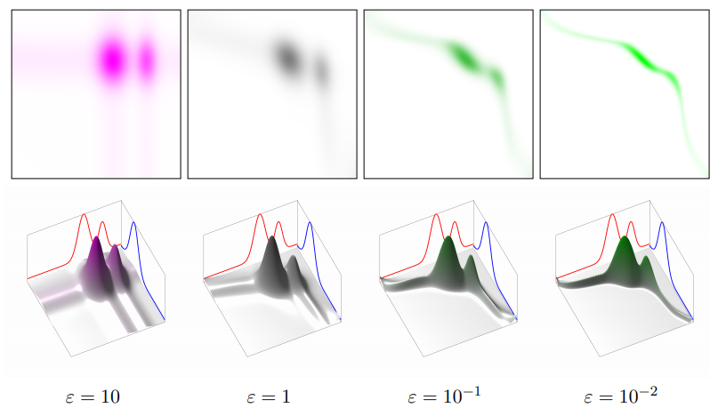
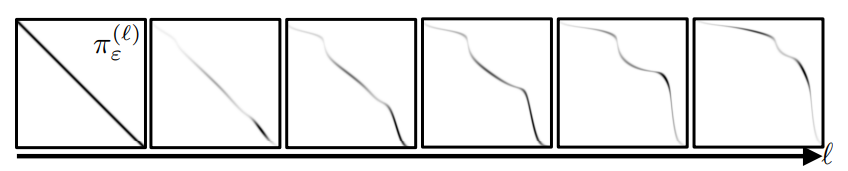

# 最优传输问题与Sinkhorn迭代

最近在看PluckerNet中遇到了最优传输问题，这里稍微对该问题和求解方法进行简单的总结。

## 问题定义

在各种优化问题中我们经常会涉及形式各样的loss表达，其中也包含了各样的distance的定义，更多的时候我们会定义点对(已知对应关系)的distance，并对点对集合进行加权求和等操作。那么问题来了，我们如何表达两个概率分布之间的距离，或者说，从分布a和b中采样得到$(\mathbf{x}, \mathbf{y})$，那么对所有可能的联合分布中能够对$\left\|\mathbf{x} - \mathbf{y}\right\|$距离取到的下界即定义为Kantorovich-Wasserstein距离；再换一个角度，可以理解为路径规划$(\mathbf{x}, \mathbf{y})$将a移动至b的消耗，而最小消耗即为Kantorovich距离，又称为Earth-Mover距离。

为了更为简单地表达，这里我们以离散形式进行讨论。定义集合$\Sigma_{n}$和$\Sigma_{m}$，如果集合中的元素可被分解传输，那么最小传输即为Kantorovich距离，如果不可分解，则为蒙日(Monge)距离，所以就有常说的Kantorovich距离是蒙日距离的松弛。给一个具体的例子，将一个沙堆$\Sigma_{n}$，使用铲子搬运至沙堆$\Sigma_{m}$，那么沙堆$\Sigma_{n}$中每一铲如何在沙堆$\Sigma_{m}$中进行对应才最省力，蒙日距离即是遵循质量守恒条件下的消耗最小问题，如果每粒沙子可以被分解传输，则为Kantorovich距离。

也可以看[这篇文章](https://michielstock.github.io/posts/2017/2017-11-5-OptimalTransport/)结合实例去理解这个问题，会比较形象一些。

针对该传输问题，Kantorovich给出了通过Coupling Matrix $\mathbf{P} \in \mathbb{R}_{+}^{n \times m}$来实现，则有
$$
\mathbf{U}(\mathbf{a}, \mathbf{b})=\left\{\mathbf{P} \in \mathbb{R}_{+}^{n \times m} \mid \mathbf{P} \mathbb{1}_{m}=\mathbf{a}, \mathbf{P}^{\mathrm{T}} \mathbb{1}_{n}=\mathbf{b}\right\} \tag{1}
$$
其中，$$\mathbf{a} \in \Sigma_{n}$$，$$\mathbf{b} \in \Sigma_{b}$$，
$$
\Sigma_{n}=\left\{\mathbf{a} \in \mathbb{R}_{+}^{n}: \sum_{i=1}^{n} \mathbf{a}_{i}=1\right\} \tag{2}
$$

$$
\Sigma_{m}=\left\{\mathbf{b} \in \mathbb{R}_{+}^{m}: \sum_{i=1}^{n} \mathbf{b}_{i}=1\right\} \tag{3}
$$

那么，定义Kantorovich距离为:
$$
\mathcal{L}_{\mathbf{C}}(\mathbf{a}, \mathbf{b})=\min _{\mathbf{P} \in \mathbf{U}(\mathbf{a}, \mathbf{b})}\langle\mathbf{C}, \mathbf{P}\rangle=\sum_{i, j} \mathbf{C}_{i j} \mathbf{P}_{i j} \tag{4}
$$
这里的$\mathbf{C}$为代价矩阵，$\mathbf{C}_{ij}$表示从$i$到$j$的传输代价，$\mathbf{P}$表示最小总代价的传输关系。

显然上式最优求解的复杂度很高，更多的时候我们更倾向于高效求解出的次优解，一种常见的做法是正则化，这里引出熵正则的概念，$\mathrm{H}(\mathbf{P})=-\sum_{i j} \mathbf{P}_{i j}\left(\log \left(\mathbf{P}_{i j}\right)-1\right)$，那么就有:
$$
\mathcal{L}_{\mathbf{C}}^{\epsilon}(\mathbf{a}, \mathbf{b})=\min _{\mathbf{P} \in \mathbf{U}(\mathbf{a}, \mathbf{b})}\langle\mathbf{C}, \mathbf{P}\rangle-\epsilon \mathrm{H}(\mathbf{P}) \tag{5}
$$
可以看出，由于$\sum_{i, j} \mathbf{P}_{i j} = 1$，熵正则更希望$\mathbf{P}_{i j}$都更均衡一些，比如两种情况，个别$\mathbf{P}_{i j}$接近1那么剩下的大多数就都接近0，另一种情况是所有$\mathbf{P}_{i j}$都比较均衡，并非0或1附近的值，那么显然后者对应的熵正则更小一些。那么同理，通过调整$\epsilon$也可以实现均衡程度的调节，当$\epsilon$接近0时求解的次优解就更接近传输问题的最优解，此时熵最大。

## Sinkhorn迭代

上一小节定义了问题，这里说说如何进行求解，那么首先需要将问题转为无约束，即将式(1)中的等式条件加入到优化目标函数中，可表示为: 
$$
\mathcal{E}(\mathbf{P}, \mathbf{f}, \mathbf{g})=\langle\mathbf{P}, \mathbf{C}\rangle-\varepsilon \mathbf{H}(\mathbf{P})-\left\langle\mathbf{f}, \mathbf{P} \mathbb{l}_{m}-\mathbf{a}\right\rangle-\left\langle\mathbf{g}, \mathbf{P}^{\mathrm{T}} \mathbb{1}_{n}-\mathbf{b}\right\rangle \tag{6}
$$
一阶导可得: 
$$
\frac{\partial \mathcal{E}(\mathbf{P}, \mathbf{f}, \mathbf{g})}{\partial \mathbf{P}_{i, j}}=\mathbf{C}_{i, j}+\epsilon \log \left(\mathbf{P}_{i, j}\right)-\mathbf{f}_{i}-\mathbf{g}_{j}=0 \tag{7}
$$

$$
\mathbf{P}_{i, j}=e^{\mathbf{f}_{i} / \epsilon} e^{-\mathbf{C}_{i, j} / \epsilon} e^{\mathbf{g}_{j} / \epsilon} \tag{8}
$$

我们可以进一步写成:
$$
\mathbf{P}_{i, j}=\mathbf{u}_{i} \mathbf{K}_{i, j} \mathbf{v}_{j} \tag{9}
$$
由于$\mathbf{C}$和$\varepsilon$已知，进而$\mathbf{K}$已知，再根据式(1)的等式条件可以表示为:
$$
\mathbf{u} \odot(\mathbf{K} \mathbf{v})=\mathbf{a} \  \text { and } \  \mathbf{v} \odot\left(\mathbf{K}^{\mathrm{T}} \mathbf{u}\right)=\mathbf{b} \tag{10}
$$
那么，很显然可以通过迭代求解的方式交替着满足左式和右式，以得到$\mathbf{u}$和$\mathbf{v}$(使用$\mathbb{1}$向量初始化): 
$$
\mathbf{u}^{(\ell+1)} \stackrel{\text { def. }}{=} \frac{\mathbf{a}}{\mathbf{K} \mathbf{v}^{(\ell)}} \  \text { and } \  \mathbf{v}^{(\ell+1)} \stackrel{\text { def. }}{=} \frac{\mathbf{b}}{\mathbf{K}^{\mathrm{T}} \mathbf{u}^{(\ell+1)}} \tag{11}
$$
迭代示意图:

其实这种迭代方式并不是很好，后续也有一些相关的改进方法。再回头结合之前的结论$\epsilon$越大使得$\mathbf{P}$更加均衡，越小越接近最优解，但是越小其求解也更加的不稳定。

## Reference

- [Computational Optimal Transport](https://arxiv.org/pdf/1803.00567.pdf)
- [michielstock: Notes on Optimal Transport](https://michielstock.github.io/posts/2017/2017-11-5-OptimalTransport/#notes_on_optimal_transport)
- [CSDN Utterly_Bonkers: 最优传输-Sinkhorn算法系列](https://blog.csdn.net/Utterly_Bonkers/article/details/90746259)

- [知乎 范帝楷: 最优传输上课笔记](https://www.zhihu.com/column/c_1308761054675976192)
- [知乎 祥丰: 计算最优传输（Computational Optimal Transport）](https://zhuanlan.zhihu.com/p/94978686)
- [PluckerNet: Learn to Register 3D Line Reconstructions](https://arxiv.org/pdf/2012.01096.pdf)