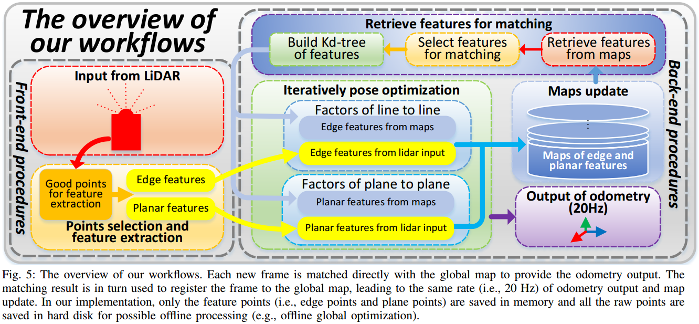
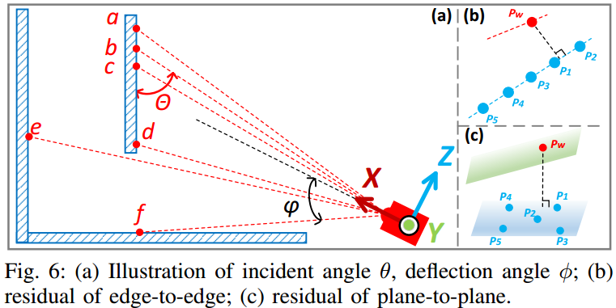

# Loam_livox: A fast, robust, high-precision LiDAR odometry and mapping package for LiDARs of small FoV
## URL  
- [https://arxiv.org/abs/1909.06700](https://arxiv.org/abs/1909.06700)
- [https://github.com/hku-mars/loam_livox](https://github.com/hku-mars/loam_livox)

## Abstract
这篇文章主要是提出了基于小FoV、非重复式扫描激光雷达的LOAM算法。

## Introduction 
固态雷达相对于常规机械雷达的不同:

- Small FoV: 和常规lidar相比，小FoV会导致一帧中的特征更少，进而导致特征匹配很容易退化以及受到运动物体的影响；
- Irregular scanning pattern: regular scanning pattern更容易特征提取，而固态雷达更多的是irregular，Livox Mid40是类似花瓣形状的；
- Non-repetitive scanning；
- Motion blur: 由于只有一个激光头，所以所有的点都是在不同时刻扫描得到，在此期间雷达一直在持续运动。

## Related Work
- point-to-point, point-to-plane, point-to-edge error metric for ICP；
- Point Feature Histograms(PFH) or Viewpoint Feature Histograms(VFH)等方法从dense pointcloud中提取3D keypoints，以减少计算量；
- 关于运动畸变问题，主要包括在前端通过运动差值的方式去畸变，和后端优化的方式，后者可以实现更高的精度但是无法实时运行；

考虑到应用场景，本文选择point-to-edge和point-to-plane方法。

本文主要focus在基于小FoV固态雷达的odometry and mapping工作，主要包括：

- 开发了适用于小FoV lidar的LOAM算法并开源；
- 通过在前端考虑雷达的物理特性以提升精度和鲁棒性；
- 提出了简单并有效的去畸变的方法，分段且并行的处理方式，实现表明这种方式比线性插值在精度和效率上更好。

## Points Selection and Feature Extraction

整个系统的框图如下，前端进行点的选择和特征提取，考虑一些例如激光点尺寸、信噪比等雷达物理特性。

### Points selection

X-Y-Z分别对应lidar的Front-Left-Up。一些简单的公式计算：

距离：$$D(\mathbf{P})=\sqrt{x^{2}+y^{2}+z^{2}}$$

反射角度：$$\phi(\mathbf{P})=\tan ^{-1}(\sqrt{\left(y^{2}+z^{2}\right) / x^{2}})$$

距离相关的反射强度：$$I(\mathbf{P})=R / D(\mathbf{P})^{2}$$，$$R$$表示物体反射率

入射角度：$$\theta\left(\mathbf{P}_{b}\right)=\cos ^{-1}\left(\frac{\left(\mathbf{P}_{a}-\mathbf{P}_{c}\right) \cdot \mathbf{P}_{b}}{\left|\mathbf{P}_{a}-\mathbf{P}_{c}\right|\left|\mathbf{P}_{b}\right|}\right)$$

关于入射角的示意图如下(注：X-Y-Z方向有误)。

对于关键点的定义：

- $$I(\mathbf{P}) \leq 7 \times 10^{-3} $$；
- $$I(\mathbf{P}) \gt 7 \times 10^{-3} \text{ and } I(\mathbf{P}) \lt 1 \times 10^{-1}$$ ，即不可太大或者太小，太大通常导致接收电路饱和或者失真进而影响精度，太小通常导致较差的信噪比进而影响精度；
- $$\theta(\mathbf{P}) \gt 5^{\circ} \text{ and } \theta(\mathbf{P}) \lt 175^{\circ}$$；
- $$\left|\mathbf{P}_{e}-\mathbf{P}_{d}\right| \geq 0.1\left|\mathbf{P}_{e}\right|, \text { and }\left|\mathbf{P}_{e}\right|>\left|\mathbf{P}_{d}\right|$$，避免一些隐藏在物体后面的点，例如上图中的$$\mathbf{P}_{e}$$。

### Feature extraction

对于选取的候选点，计算local smoothness以提取线面特征，另外引入反射率作为第四维信息，以缓和小FoV限制而引入的匹配退化问题。如果点的反射率和相邻点云不同，我们认为这是边缘特征。

## Iterative Pose Optimization

由于非重复式扫描，提取的特征不能够被持续跟踪。本文提出了迭代位姿优化的方法，可以实现20Hz的实时定位和建图。

### Residual of edge-to-edge

见图1-b，对于当前帧中边缘特征中的点，在地图边缘特征中寻找5个最接近的点，使用KD-tree(另一个并行线程中进行，每当上一个注册帧到达时更新)进行加速。对于这些local点需要变换到global下，文中使用当前帧的最后一个点采样时刻对应的位姿表示当前帧位姿，同时当前帧的最后一个点也很接近下一帧第一个点。

为了确保最接近的点确实在一条线上，通过特征值分解，如果最大的特征值是第二大特征值的三倍以上则认为是线特征。

$\mathbf{r}_{e 2 e}=\frac{\left|\left(\mathbf{P}_{w}-\mathbf{P}_{5}\right) \times\left(\mathbf{P}_{w}-\mathbf{P}_{1}\right)\right|}{\left|\mathbf{P}_{5}-\mathbf{P}_{1}\right|}$

### Residual of plane-to-plane

见图1-c，基本和edge-to-edge类似。

$\mathbf{r}_{p 2 p}=\frac{\left(\mathbf{P}_{w}-\mathbf{P}_{1}\right)^{T}\left(\left(\mathbf{P}_{3}-\mathbf{P}_{5}\right) \times\left(\mathbf{P}_{3}-\mathbf{P}_{1}\right)\right)}{\left|\left(\mathbf{P}_{3}-\mathbf{P}_{5}\right) \times\left(\mathbf{P}_{3}-\mathbf{P}_{1}\right)\right|}$

### In-frame motion compensation

#### Piecewise processing

将一帧拆分成三个子帧，独立地和相同的地图进行匹配，并使用完整帧最后一个点位姿统一注册地图。这样每帧的帧间隔就变成了三分之一进而减少畸变。

#### Linear interpolation

比较常见了，简单贴几个公式：

$s=\left(t-t_{k-1}\right) /\left(t_{k}-t_{k-1}\right)$

$\mathbf{R}_{k-1}^{t}=e^{\hat{\omega} \theta s}, \quad \mathbf{T}_{k-1}^{t}=s \mathbf{T}_{k-1}^{k}$

$\mathbf{R}_{k-1}^{t}=\mathbf{I}+\widehat{\omega} \sin (s \theta)+\hat{\omega}^{2}(1-\cos (s \theta))$

$\mathbf{R}_{t}=\mathbf{R}_{k-1} \mathbf{R}_{k-1}^{t}, \quad \mathbf{T}_{t}=\mathbf{R}_{k-1} \mathbf{T}_{k-1}^{t}+\mathbf{T}_{k-1}$

$\mathbf{P}_{w}(t)=\mathbf{R}_{t} \mathbf{P}_{l}+\mathbf{T}_{t}$

### Outliers rejection, dynamic objects filtering

为了避免运动物体的影响，每次迭代后会重新构建edge-to-edge和plane-to-plane约束，且第一次优化是仅迭代两次，使用该结果，移除top 20%残差的约束。

## Results
- Evaluation of mapping: 评估两种去畸变方法的效果，线性插值会差一些主要是由于手持实验设备可能存在的忽动忽静的行为无法被简单的差值捕获到；
- Evaluation of odometry: 和运动捕捉系统相比，欧拉角误差小于1.1$$^{\circ}$$；
- Evaluation of running performance: 由于sub-frame和KD-tree，速度方面得到了提升。

## Conclusion
笔者个人观点：

通过拜读论文和代码，发现作者提出的一些思路还是不错的，这里就不重复了，这里主要记录一些认为可能的改进点，主要针对提速之后的场景：

- 这篇工作面向的运动速度很低，可能比较适合不要求运动速度的场景，可以发挥Livox的精度和稠密优势，避开小FoV少特征等痛点
- 关于当前帧沿用上一帧pose的方法或许可以通过多个运动模型选择更好的初始解
- 对于小FoV和特征较少的问题，这篇工作强假设慢速运动，求解过程中有比较多的运动范围假设，除此之外或许可以引入imu帧间约束以避免匹配退化的问题，且避免这样的强假设
- 关于运动去畸变，Livox运动畸变严重，这是不可忽略的问题，关于作者提到的前端方法或者后端优化，这个地方可能需要更多的工作
- 硬件结构层面，或许可以通过多个设备组合的方式实现FoV的增大，虽然这是成本、算力等因素的平衡，但是信息足够少的话注定巧妇难为无米之炊